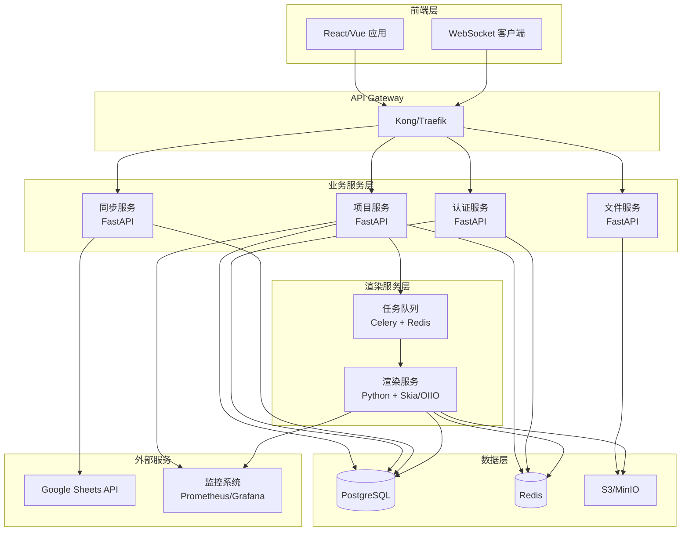

# 新架构方案分析

## 📋 提出的架构方案

- **前端**: React/Vue
- **后端**: 微服务架构
- **图像处理**: Python（OIIO、OCIO、FFmpeg、Skia 官方支持）

## ✅ 架构符合度分析

### 1. 前端：React/Vue ✅ **完全符合**

**优势**：
- ✅ 现代化组件化开发
- ✅ 丰富的生态系统
- ✅ 更好的开发体验（TypeScript、HMR）
- ✅ 更好的性能（虚拟 DOM、代码分割）
- ✅ 更好的状态管理（Redux、Zustand、Pinia）

**对比现有架构**：
- 现有：Nunjucks 模板 + jQuery（服务器端渲染）
- 新架构：完全客户端渲染，更灵活

### 2. 后端：微服务架构 ✅ **非常适合**

**优势**：
- ✅ 独立扩展（渲染服务可以单独扩容）
- ✅ 技术栈灵活（不同服务可以用不同技术）
- ✅ 故障隔离（一个服务出问题不影响其他）
- ✅ 团队协作（不同团队负责不同服务）

**需要的微服务**：
1. **API Gateway** - 统一入口、路由、认证
2. **项目服务** - 项目管理、CRUD
3. **渲染服务** - 图像/视频渲染（Python）
4. **同步服务** - Google Sheets 同步
5. **文件服务** - 文件上传、存储、下载
6. **通知服务** - WebSocket、SSE、邮件通知
7. **认证服务** - 用户认证、权限管理

### 3. 图像处理：Python ✅ **最佳选择**

**Python 的优势**：

| 库/工具 | Python 支持 | Spring Boot | Node.js |
|---------|------------|-------------|---------|
| **OpenImageIO (OIIO)** | ✅ 官方 Python 绑定 | ❌ 无 | ❌ 无 |
| **OpenColorIO (OCIO)** | ✅ 官方 Python 绑定 | ❌ 无 | ❌ 无 |
| **FFmpeg** | ✅ python-ffmpeg | ⚠️ 需要 JNI | ⚠️ 需要子进程 |
| **Skia** | ✅ skia-python | ❌ 无 | ❌ 无 |
| **NumPy** | ✅ 原生 | ⚠️ 需要 JNI | ⚠️ 性能差 |
| **Pillow** | ✅ 原生 | ⚠️ 需要 JNI | ⚠️ 性能差 |

**结论**：Python 是唯一对所有这些库都有官方或成熟支持的语言。

## ❌ 缺少的关键组件

### 1. **消息队列/任务队列** ⚠️ **必需**

**为什么需要**：
- 渲染任务可能耗时很长（几分钟到几小时）
- 需要异步处理，不能阻塞 API
- 需要任务重试、优先级、进度跟踪

**推荐方案**：
- **Celery** (Python) + **Redis/RabbitMQ**
- 或 **Kafka** (大规模场景)

### 2. **数据库选型** ⚠️ **需要明确**

**建议**：
- **PostgreSQL** - 主数据库（项目数据、用户数据）
- **Redis** - 缓存、会话、任务队列
- **MongoDB** (可选) - 如果项目数据是文档结构

### 3. **服务发现与配置中心** ⚠️ **微服务必需**

**推荐方案**：
- **Consul** / **etcd** / **Zookeeper** - 服务发现
- **Vault** / **AWS Secrets Manager** - 配置管理
- 或使用 **Kubernetes** 内置服务发现

### 4. **API Gateway** ⚠️ **微服务必需**

**功能**：
- 统一入口
- 路由转发
- 认证授权
- 限流熔断
- 日志监控

**推荐方案**：
- **Kong** / **Traefik** / **Nginx**
- 或 **Spring Cloud Gateway** (如果部分服务用 Java)

### 5. **监控与日志** ⚠️ **生产环境必需**

**需要**：
- **Prometheus** + **Grafana** - 指标监控
- **ELK Stack** (Elasticsearch, Logstash, Kibana) - 日志聚合
- **Jaeger** / **Zipkin** - 分布式追踪
- **Sentry** - 错误追踪

### 6. **容器化与编排** ⚠️ **微服务必需**

**推荐**：
- **Docker** - 容器化
- **Kubernetes** - 容器编排
- **Helm** - K8s 包管理

### 7. **前端状态管理** ⚠️ **需要明确**

**React 推荐**：
- **Redux Toolkit** - 复杂状态
- **Zustand** - 轻量级
- **React Query** - 服务器状态

**Vue 推荐**：
- **Pinia** - 官方推荐
- **Vuex** (已废弃，不推荐)

### 8. **实时通信** ⚠️ **协作功能必需**

**需要**：
- **WebSocket** - 实时编辑同步
- **Socket.io** (Node.js) 或 **FastAPI WebSocket** (Python)
- **Redis Pub/Sub** - 跨服务消息传递

### 9. **文件存储** ⚠️ **需要明确**

**选项**：
- **AWS S3** / **Google Cloud Storage** - 对象存储
- **MinIO** - 自托管 S3 兼容
- **本地文件系统** (开发环境)

### 10. **CI/CD** ⚠️ **开发流程必需**

**推荐**：
- **GitHub Actions** / **GitLab CI** / **Jenkins**
- **Docker Registry** - 镜像仓库
- **Kubernetes** - 自动部署

## 🏗️ 推荐的完整微服务架构

## 🎯 新架构的优点

### 1. **技术栈优势**

#### Python 图像处理生态
- ✅ **OIIO**: 官方 Python 绑定，无需 JNI
- ✅ **OCIO**: 官方 Python 绑定，色彩管理更精确
- ✅ **Skia**: skia-python 成熟稳定
- ✅ **FFmpeg**: python-ffmpeg 封装完善
- ✅ **NumPy**: 原生支持，性能优秀

#### 前端现代化
- ✅ **React/Vue**: 组件化、可维护性强
- ✅ **TypeScript**: 类型安全，减少错误
- ✅ **现代工具链**: Vite、ESBuild、热更新

### 2. **架构优势**

#### 微服务架构
- ✅ **独立扩展**: 渲染服务可以单独扩容（CPU 密集型）
- ✅ **技术选型灵活**: 不同服务可以用最适合的技术
- ✅ **故障隔离**: 一个服务崩溃不影响其他
- ✅ **团队协作**: 不同团队可以并行开发

#### 性能优化
- ✅ **异步处理**: 渲染任务不阻塞 API
- ✅ **缓存策略**: Redis 缓存热点数据
- ✅ **CDN**: 静态资源和文件通过 CDN 加速

### 3. **开发体验优势**

- ✅ **类型安全**: TypeScript + Pydantic
- ✅ **热更新**: 前端 HMR，后端自动重载
- ✅ **调试工具**: React DevTools, Python Debugger
- ✅ **测试支持**: Jest, Pytest, 单元测试、集成测试

### 4. **运维优势**

- ✅ **容器化**: Docker 统一环境
- ✅ **编排**: Kubernetes 自动扩缩容
- ✅ **监控**: Prometheus + Grafana 全方位监控
- ✅ **日志**: ELK Stack 集中日志管理

## 📊 架构对比

| 维度 | 现有架构 (Endcrawl) | 新架构 |
|------|-------------------|--------|
| **前端** | Nunjucks + jQuery | React/Vue + TypeScript |
| **后端** | 单体应用 | 微服务架构 |
| **渲染** | 未知（可能是无头浏览器） | Python + Skia/OIIO |
| **扩展性** | 垂直扩展 | 水平扩展（微服务） |
| **技术栈** | 固定技术栈 | 灵活选型 |
| **开发效率** | 传统开发模式 | 现代化工具链 |
| **类型安全** | 弱类型（JavaScript） | 强类型（TypeScript + Python） |
| **测试** | 手动测试为主 | 自动化测试 |
| **部署** | 传统部署 | 容器化 + K8s |

## 🚀 实施建议

### 阶段 1: 基础架构（1-2 个月）
1. ✅ 搭建 API Gateway
2. ✅ 设置服务发现和配置中心
3. ✅ 搭建数据库和缓存
4. ✅ 搭建 CI/CD 流水线
5. ✅ 搭建监控和日志系统

### 阶段 2: 核心服务（2-3 个月）
1. ✅ 开发认证服务
2. ✅ 开发项目服务（CRUD）
3. ✅ 开发文件服务
4. ✅ 开发前端基础框架

### 阶段 3: 渲染服务（2-3 个月）
1. ✅ 开发渲染服务（Python + Skia/OIIO）
2. ✅ 集成任务队列（Celery）
3. ✅ 实现预览功能
4. ✅ 实现最终渲染功能

### 阶段 4: 高级功能（2-3 个月）
1. ✅ 开发同步服务（Google Sheets）
2. ✅ 实现实时协作（WebSocket）
3. ✅ 实现版本控制
4. ✅ 性能优化

## ⚠️ 潜在挑战

### 1. **微服务复杂度**
- **挑战**: 服务间通信、数据一致性、分布式事务
- **解决**: 使用消息队列、事件驱动、最终一致性

### 2. **Python 性能**
- **挑战**: Python GIL 限制多线程性能
- **解决**: 使用多进程、异步 I/O、Cython 优化关键路径

### 3. **前后端渲染一致性**
- **挑战**: 前端预览和后端渲染结果可能不一致
- **解决**: 
  - 共享渲染逻辑（WebAssembly）
  - 或前端使用 Canvas，后端使用相同算法
  - 建立视觉回归测试

### 4. **学习曲线**
- **挑战**: 团队需要学习新技术栈
- **解决**: 渐进式迁移、培训、文档

## 📝 总结

### ✅ 架构符合度：**95%**

**优点**：
- ✅ Python 图像处理生态完美匹配
- ✅ 微服务架构适合渲染密集型应用
- ✅ React/Vue 现代化前端体验好

**需要补充**：
- ⚠️ 消息队列（Celery + Redis）
- ⚠️ 服务发现和配置中心
- ⚠️ API Gateway
- ⚠️ 监控和日志系统
- ⚠️ 容器化和编排
- ⚠️ 文件存储方案

**建议**：
1. 先搭建基础架构（消息队列、数据库、监控）
2. 再开发核心服务（项目、渲染）
3. 最后完善高级功能（协作、同步）

这个架构方案**非常适合**你的项目需求，特别是 Python 对图像处理库的支持是其他语言无法比拟的优势。

