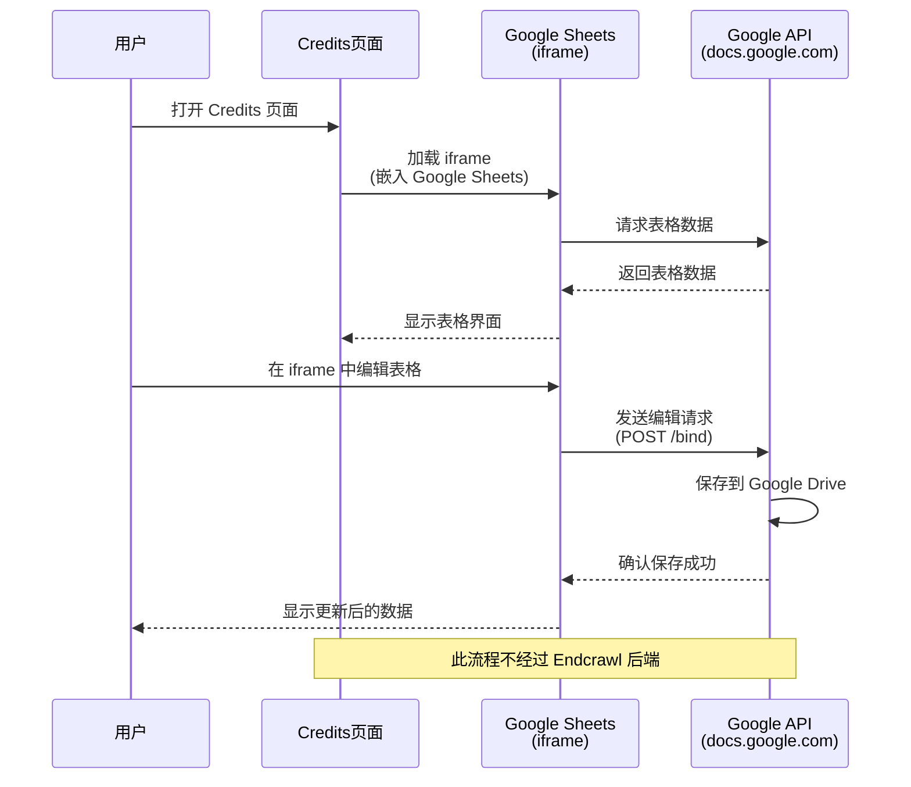
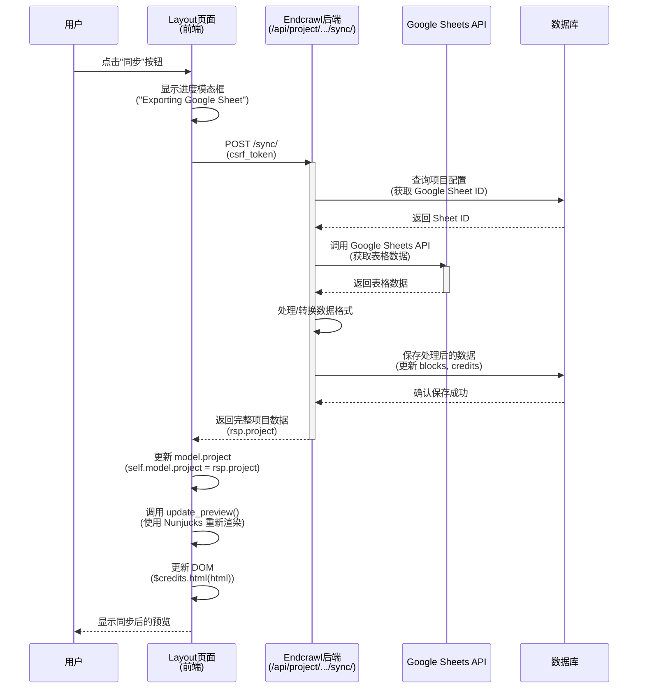
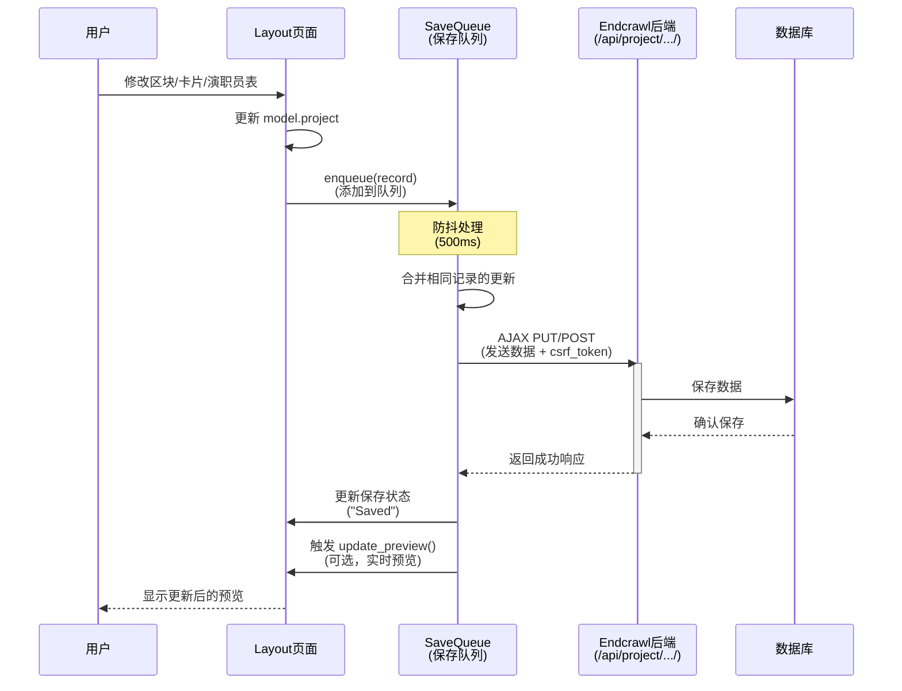
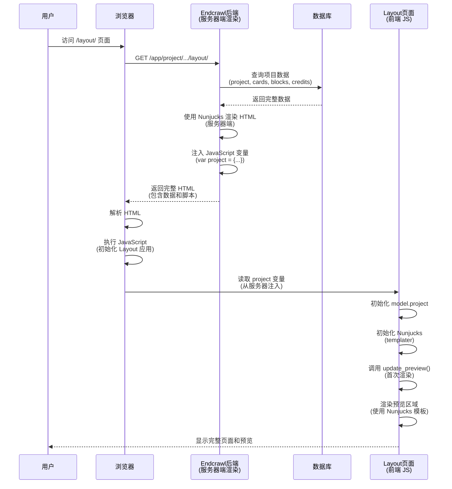
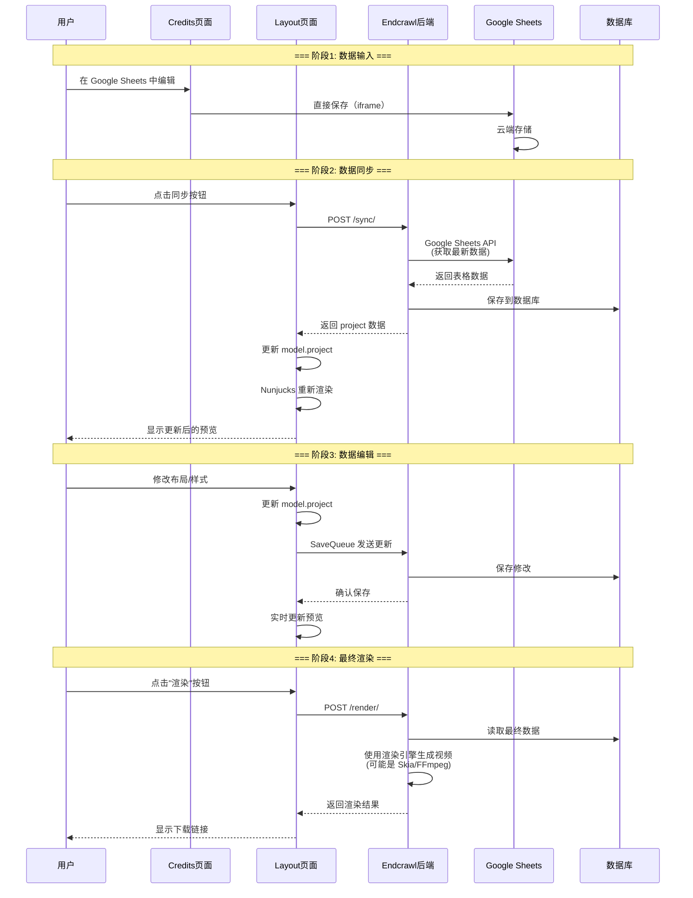

# Endcrawl 前后端协作流程序列图

## 1. Credits 页面 - Google Sheets 直接编辑流程

## 2. Layout 页面 - 同步 Google Sheets 数据流程

## 3. Layout 页面 - 数据保存流程（SaveQueue）

## 4. Layout 页面 - 页面初始加载流程

## 5. 完整数据流转图

## 关键技术点总结

### 前端渲染技术
- **Credits 页面**: iframe 直接嵌入 Google Sheets（无后端参与）
- **Layout 页面**: Nunjucks 模板引擎 + 客户端渲染
- **数据更新**: 通过 AJAX 与后端 API 交互

### 后端处理技术
- **数据同步**: 调用 Google Sheets API 获取数据
- **数据存储**: 保存到数据库
- **服务器端渲染**: 初始页面使用 Nunjucks 生成 HTML

### 数据一致性保证
- **共享模板**: 前后端使用相同的 Nunjucks 模板
- **统一数据模型**: `project` 对象结构一致
- **实时同步**: 同步后立即更新前端模型

### 渲染流程
1. **预览渲染**: 前端 Nunjucks 实时渲染（快速反馈）
2. **最终渲染**: 后端专用渲染引擎（高质量输出）

