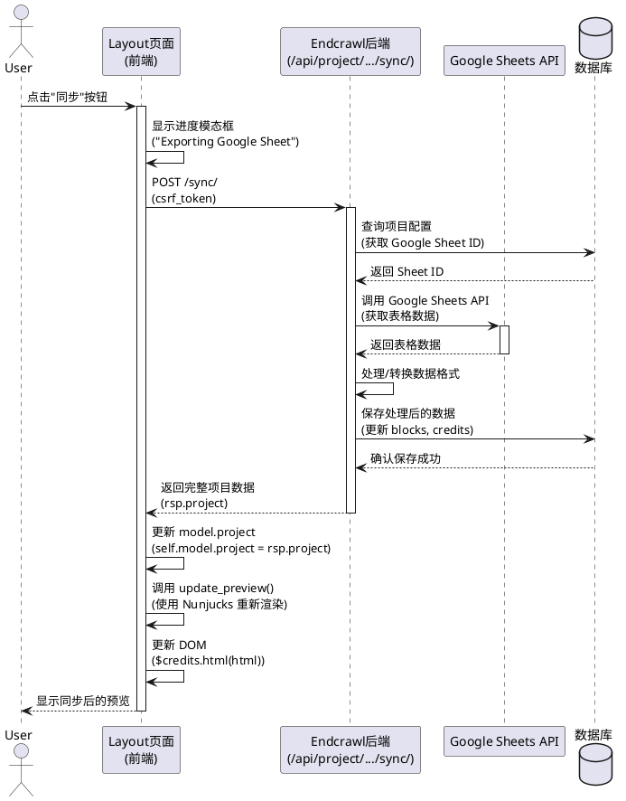
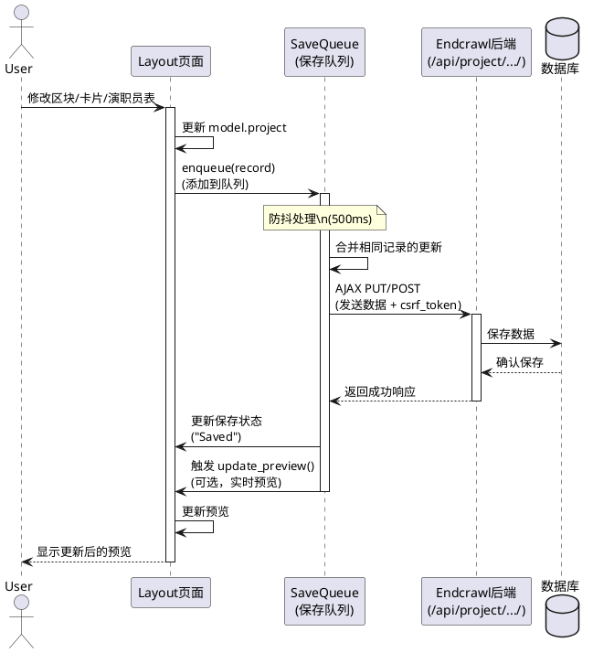
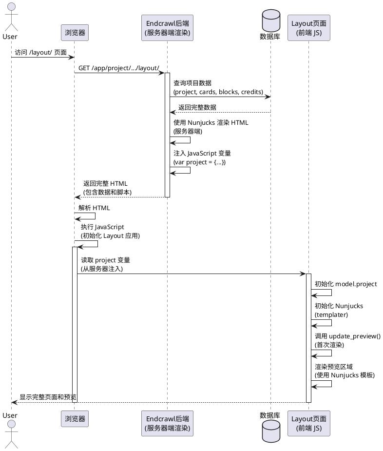
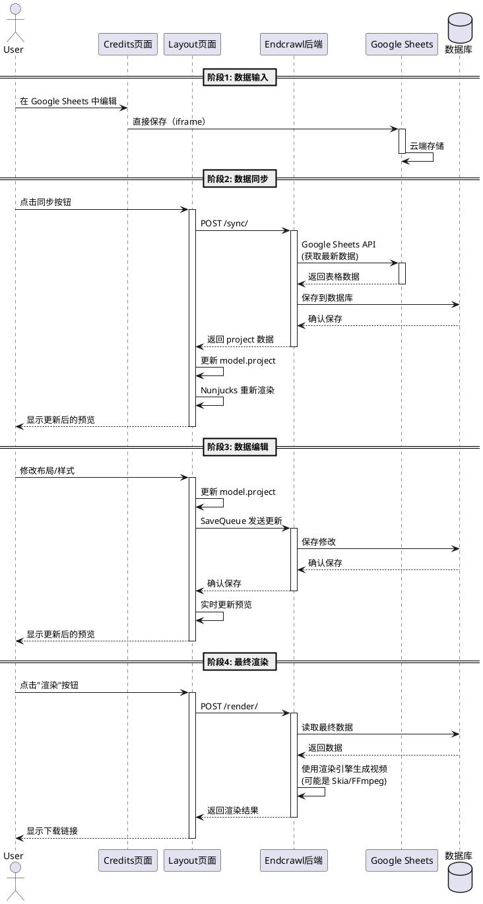

# Endcrawl 前后端协作流程 - UML 序列图

## 1. Credits 页面 - Google Sheets 直接编辑流程（UML PlantUML 格式）

```plantuml
@startuml CreditsPage_GoogleSheets_Flow
actor User as 用户
participant "Credits页面" as CreditsPage
participant "Google Sheets\n(iframe)" as GoogleSheets
participant "Google API\n(docs.google.com)" as GoogleAPI

用户 -> Credits页面: 打开 Credits 页面
Credits页面 -> GoogleSheets: 加载 iframe\n(嵌入 Google Sheets)
GoogleSheets -> GoogleAPI: 请求表格数据
GoogleAPI --> GoogleSheets: 返回表格数据
GoogleSheets --> Credits页面: 显示表格界面

用户 -> GoogleSheets: 在 iframe 中编辑表格
GoogleSheets -> GoogleAPI: 发送编辑请求\n(POST /bind)
activate GoogleAPI
GoogleAPI -> GoogleAPI: 保存到 Google Drive
GoogleAPI --> GoogleSheets: 确认保存成功
deactivate GoogleAPI
GoogleSheets --> 用户: 显示更新后的数据

note right of Credits页面, GoogleAPI
  此流程不经过 Endcrawl 后端
end note
@enduml
```

## 2. Layout 页面 - 同步 Google Sheets 数据流程（UML PlantUML 格式）



## 3. Layout 页面 - 数据保存流程（SaveQueue）（UML PlantUML 格式）



## 4. Layout 页面 - 页面初始加载流程（UML PlantUML 格式）



## 5. 完整数据流转图（UML PlantUML 格式）



## 格式说明

### Mermaid vs UML PlantUML

| 特性 | Mermaid | UML PlantUML |
|------|---------|--------------|
| **语法** | 简化语法 | 标准 UML 语法 |
| **支持** | GitHub/GitLab 原生支持 | 需要 PlantUML 工具 |
| **激活框** | `activate/deactivate` | `activate/deactivate` |
| **注释** | `Note over` | `note right/left` |
| **分组** | `==` | `==` |
| **参与者** | `participant` | `participant` 或 `actor` |

### 如何查看 UML 图

1. **在线工具**：
   - http://www.plantuml.com/plantuml/uml/
   - 复制代码到在线编辑器即可查看

2. **VS Code 插件**：
   - 安装 "PlantUML" 插件
   - 右键选择 "Preview PlantUML"

3. **本地工具**：
   - 安装 PlantUML：`brew install plantuml` (macOS)
   - 或使用 Docker：`docker run -d -p 8080:8080 plantuml/plantuml-server:jetty`

### 两种格式的选择

- **Mermaid**：适合文档、GitHub README、快速查看
- **UML PlantUML**：适合正式文档、需要标准 UML 格式、与 UML 工具集成

两个版本都已提供，可根据需要选择使用。

